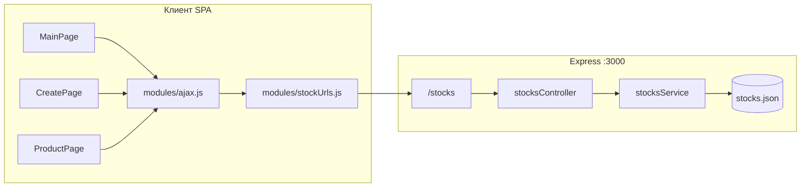

# Лабораторная работа 5

## Содержание

- [Тема](#тема)
- [Цель работы](#цель-работы)
- [Постановка задачи](#постановка-задачи)
- [Использованные технологии](#использованные-технологии)
- [Архитектура решения](#архитектура-решения)
- [Структура проекта](#структура-проекта)
- [Серверная часть (REST API)](#серверная-часть-rest-api)
- [Клиентская часть](#клиентская-часть)
- [Модуль Ajax](#модуль-ajax)
- [Определение адреса API](#определение-адреса-api)
- [Реализованный функционал](#реализованный-функционал)
- [Запуск и проверка](#запуск-и-проверка)
- [Примеры HTTP-запросов](#примеры-http-запросов)
- [Результаты](#результаты)
- [Выводы](#выводы)

---

## Тема

Интеграция SPA-клиента с REST API: CRUD-операции над карточками статей через Express и Ajax.

## Цель работы

Научиться строить полноценное клиент–серверное приложение: реализовать HTTP API на Node.js (Express), организовать обмен данными с фронтендом через Ajax, выполнить операции чтения, создания и удаления сущностей с сохранением в файл.

## Постановка задачи

На базе SPA из [лабораторной работы 3](README-lab3.md) необходимо:

1. Вынести данные карточек на сервер и описать REST API для ресурса `stocks`.
2. Реализовать на клиенте модуль для HTTP-запросов (GET, POST, PATCH, DELETE).
3. Загружать список статей с сервера, а не из захардкоженного массива.
4. Добавить фильтрацию по заголовку и ограничение количества карточек на экране.
5. Реализовать создание новой карточки (форма + POST) и удаление (DELETE).
6. Обеспечить работу при разных способах запуска фронтенда (Express на `:3000` или Live Server на другом порту).

## Использованные технологии

| Слой | Технологии |
|------|------------|
| Клиент | JavaScript (ES Modules), HTML5, CSS3, Bootstrap 5, `XMLHttpRequest` |
| Сервер | Node.js, Express 5, файловое хранилище JSON |
| Инфраструктура | CORS, статическая раздача фронтенда с Express |

## Архитектура решения



Клиент не хранит постоянный каталог статей: при открытии главной страницы выполняется `GET /stocks`, при создании — `POST /stocks`, при удалении — `DELETE /stocks/:id`.

## Структура проекта

```
it-infrastructure-maintenance/
├── index.html              # Точка входа SPA
├── main.js                 # Инициализация MainPage
├── styles.css              # Стили интерфейса
├── modules/
│   ├── ajax.js             # Обёртка над XMLHttpRequest
│   └── stockUrls.js        # Формирование URL API
├── pages/
│   ├── main/index.js       # Список, фильтр, лимит, удаление
│   ├── create/index.js     # Форма создания карточки
│   └── product/index.js    # Детальная страница
├── components/             # UI-компоненты (карточка, статья, «Назад»)
└── example-express/
    └── src/
        ├── index.js        # Сервер, CORS, static, маршруты
        ├── routes/stocks.js
        ├── controllers/stocksController.js
        ├── services/
        │   ├── stocksService.js
        │   └── fileService.js
        └── data/stocks.json  # Хранилище карточек
```

## Серверная часть (REST API)

Сервер поднимается из каталога `example-express` и слушает порт **3000** на `0.0.0.0` (удобно для WSL).

### Маршруты

| Метод | URL | Действие |
|-------|-----|----------|
| `GET` | `/stocks` | Список карточек; query-параметр `title` — фильтр по подстроке в заголовке |
| `GET` | `/stocks/:id` | Одна карточка по `id` |
| `POST` | `/stocks` | Создание; тело JSON: `{ src, title, text }` |
| `PATCH` | `/stocks/:id` | Частичное обновление |
| `DELETE` | `/stocks/:id` | Удаление (ответ `204 No Content`) |

### Слои сервера

- **Маршруты** (`routes/stocks.js`) — привязка URL к обработчикам.
- **Контроллер** (`controllers/stocksController.js`) — валидация входа, коды ответов `400`, `404`, `201`, `204`.
- **Сервис** (`services/stocksService.js`) — бизнес-логика: поиск, фильтрация, генерация `id` (max + 1), запись в файл.
- **fileService** — синхронное чтение/запись `stocks.json`.

### CORS и раздача фронтенда

В `example-express/src/index.js` включены заголовки `Access-Control-Allow-Origin: *` для запросов с Live Server и других портов. Статика корня репозитория отдаётся через `express.static`, поэтому приложение можно открывать одним адресом `http://localhost:3000` без отдельного Live Server.

## Клиентская часть

### Главная страница (`pages/main/index.js`)

- `GET /stocks?title=...` — загрузка и фильтрация на сервере (параметр передаётся при вводе в поле поиска).
- Лимит карточек — клиентская обрезка массива (`slice`) после получения данных.
- Кнопка «+» открывает страницу создания.
- Кнопка «Удалить» на карточке вызывает `DELETE /stocks/:id` и обновляет список.
- Кнопка «Открыть» ведёт на `ProductPage` с загрузкой `GET /stocks/:id`.

### Страница создания (`pages/create/index.js`)

- Форма с полями `src`, `title`, `text`.
- Валидация на клиенте; при успехе — `POST /stocks` и возврат на главную.

### Детальная страница (`pages/product/index.js`)

- Загрузка одной карточки по `id` через `GET /stocks/:id`.
- Компонент `BackButtonComponent` для возврата к списку.

## Модуль Ajax

Файл `modules/ajax.js` — класс `Ajax` с методами:

- `get(url, callback)`
- `post(url, data, callback)` — тело `application/json`
- `patch(url, data, callback)`
- `delete(url, callback)`

Общий обработчик `_handleResponse` парсит JSON и передаёт в callback `(data, status)`. Логирование запросов выводится в консоль браузера.

## Определение адреса API

`modules/stockUrls.js` вычисляет базовый URL API:

1. `localStorage.apiBase` — если задан вручную.
2. Query-параметр `?apiHost=...` — для WSL/удалённого хоста.
3. Если сайт открыт на порту `3000` — API на том же `origin`.
4. Иначе — `http://<hostname>:3000` (типичный случай Live Server на `:5503`).

Так клиент корректно обращается к Express независимо от порта статики.

## Реализованный функционал

| Функция | Реализация |
|---------|------------|
| Загрузка списка | `MainPage.getData()` → `ajax.get` |
| Фильтр по заголовку | query `title` на сервере |
| Лимит отображения | поле «Лимит» + `slice` на клиенте |
| Просмотр статьи | `ProductPage` + `GET /stocks/:id` |
| Создание карточки | `CreatePage` + `POST /stocks` |
| Удаление карточки | `DELETE /stocks/:id` |
| Popover Bootstrap | кнопка «Подробнее» на карточке |
| Сохранение данных | `example-express/src/data/stocks.json` |

## Запуск и проверка

### Рекомендуемый способ (один порт)

```bash
cd example-express
npm install
npm start
```

Открыть в браузере: [http://localhost:3000](http://localhost:3000)

При работе в WSL, если `localhost` недоступен с Windows, использовать IP из вывода консоли (например `http://172.x.x.x:3000`).

### Альтернатива: Live Server

Фронтенд на порту из `.vscode/settings.json` (5503), API — на `:3000`. Нужен запущенный Express; CORS на сервере уже настроен.

### Проверка сценариев

1. Открыть главную — отображаются карточки из `stocks.json`.
2. Ввести текст в фильтр — список сужается (запрос с `?title=`).
3. Указать лимит — на экране не больше N карточек.
4. Создать карточку через «+» — после отправки она появляется в списке и в JSON-файле.
5. Удалить карточку — исчезает из UI и из файла.
6. Открыть карточку — детальная страница с данными с сервера.

## Примеры HTTP-запросов

**Список с фильтром:**

```http
GET /stocks?title=мышь HTTP/1.1
Host: localhost:3000
```

**Создание:**

```http
POST /stocks HTTP/1.1
Host: localhost:3000
Content-Type: application/json

{"src":"https://example.com/img.jpg","title":"Заголовок","text":"Описание"}
```

**Удаление:**

```http
DELETE /stocks/10 HTTP/1.1
Host: localhost:3000
```

## Результаты

В рамках лабораторной получено клиент–серверное приложение «Новости и статьи ALP ITSM»:

- фронтенд остаётся SPA с компонентной структурой (наследие ЛР3);
- данные централизованы на сервере в JSON-файле;
- реализован REST API с полным набором CRUD-методов;
- клиент использует единый модуль Ajax для всех операций;
- поддержаны фильтрация, создание и удаление карточек из интерфейса.

Коммиты ветки `lab5`: введение Ajax, фильтрация/добавление/удаление, доработки CORS и единого запуска через Express.

## Выводы

Лабораторная работа закрепляет переход от статического SPA к архитектуре с backend API. Разделение на маршруты, контроллеры и сервисы упрощает сопровождение серверного кода; модуль `stockUrls` изолирует знание клиента об адресе API. Для production-подобных систем JSON-файл следует заменить СУБД, а синхронный `fs` — асинхронным доступом или очередью записи; для учебного проекта выбранный вариант достаточен и наглядно демонстрирует полный цикл CRUD.
